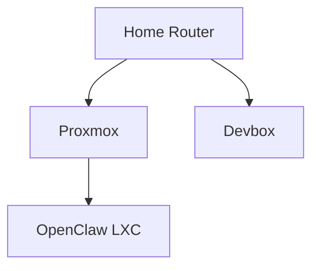

# Network Atlas

## Project Charter

Build a small Hermes-native plugin that gives Hermes a persistent, structured understanding of the local home network.

The plugin should allow Hermes to:

1. remember known devices, addresses, interfaces, services, and relationships;
2. safely rediscover the local network;
3. inspect explicitly authorized machines over SSH using bounded read-only probes;
4. distinguish observed facts from inference and user-supplied knowledge;
5. detect changes between observations;
6. answer questions about the network from structured state; and
7. generate a simple human-readable network topology.

The system should be entirely contained within the Hermes environment.

Do **not** introduce NetBox, a separate database server, a web application, MCP server, or other persistent service.

---

# 1. Goal

Give Hermes a durable **network atlas** rather than relying on conversational memory to remember infrastructure.

Example questions the finished system should support:

- What machines do you know about on my network?
- Which machines can you access over SSH?
- What IP does OpenClaw currently have?
- What LXCs or VMs are associated with the Proxmox host?
- Which hosts have changed since the last discovery?
- What devices have disappeared recently?
- What is connected to what?
- Refresh your understanding of my home network.
- Show me the current network map.

The atlas should be useful both to the primary Hermes agent and to delegated agents working on infrastructure or development tasks.

---

# 2. Non-Goals

Do **not** turn this into:

- a general-purpose vulnerability scanner;
- an autonomous penetration-testing tool;
- a full CMDB/IPAM/DCIM replacement;
- an SNMP monitoring system;
- a metrics/time-series platform;
- a network configuration manager;
- an arbitrary remote-shell abstraction;
- an autonomous network remediation system;
- a replacement for Hermes memory providers.

Network Atlas observes and remembers.

It does **not** modify network infrastructure.

---

# 3. Implementation Form

Implement this as a normal Hermes user plugin.

Target installation:

```text
~/.hermes/plugins/network-atlas/
├── plugin.yaml
├── __init__.py
├── schemas.py
├── tools.py
├── discovery/
├── storage/
├── render/
└── tests/
```

Hermes currently supports user plugins under `~/.hermes/plugins/` and allows plugins to register tools, hooks, slash commands, and CLI commands.

This should **not** be implemented as a Hermes memory-provider plugin. Network state has stronger structure, provenance, and reconciliation requirements than conversational memory. Hermes's normal `MEMORY.md` / `USER.md` system should remain independent.

---

# 4. Design Principles

## 4.1 Structured truth over prose memory

The canonical atlas must use structured local persistence.

Preferred implementation:

```text
~/.hermes/network-atlas/
├── atlas.sqlite3
├── config.yaml
└── exports/
    ├── network.md
    └── network.mmd
```

SQLite is preferred over YAML as the canonical store because we need:

- current state;
- observation history;
- provenance;
- relationships;
- aliases;
- timestamps;
- reconciliation;
- stale-state handling.

Human-readable Markdown and Mermaid should be **generated outputs**, not the authoritative database.

---

## 4.2 Observation is not truth

Every discovered property must record where it came from.

Example:

```text
fact:
    device: openclaw
    property: ipv4
    value: 192.168.1.23
    source: ssh:openclaw
    observed_at: 2026-09-30T13:30:00-05:00
    confidence: observed
```

The model must never silently convert speculation into authoritative state.

Track at least:

- `observed`
- `inferred`
- `user_supplied`

User-supplied information should normally outrank an inference.

Fresh direct observations may supersede previous observations while preserving history.

---

## 4.3 Absence is not deletion

If a device does not respond during discovery:

```text
status = stale
```

Do not delete it.

Maintain:

```text
first_seen
last_seen
last_checked
status
```

Suggested statuses:

```text
observed
known
stale
retired
unknown
```

Explicit user action should be required to retire/remove persistent records.

---

## 4.4 Discovery must be bounded

Network Atlas may only discover networks explicitly configured in its allowlist.

Example:

```yaml
discovery:
  allowed_networks:
    - 192.168.1.0/24
```

Never derive additional scan ranges from routes and automatically scan them.

Never scan:

- VPN networks;
- Tailscale networks;
- Docker networks;
- Kubernetes networks;
- cloud networks;
- arbitrary remotely reachable subnets;

unless explicitly added to the configuration.

---

# 5. Core Data Model

Keep the model small.

## Device

```text
id
canonical_name
hostname
device_type
manufacturer
os
description
status
first_seen
last_seen
```

Suggested device types:

```text
router
switch
access_point
hypervisor
server
desktop
laptop
nas
vm
lxc
iot
printer
unknown
```

Do not force a type when it cannot be reliably determined.

---

## Interface

```text
id
device_id
name
mac_address
interface_type
state
```

Examples:

```text
ethernet
wifi
bridge
vlan
virtual
loopback
unknown
```

---

## Address

```text
id
interface_id
address
prefix_length
address_family
source
first_seen
last_seen
```

---

## Relationship

Represent topology separately from devices.

```text
source_device
source_interface
target_device
target_interface
relationship_type
confidence
source
observed_at
```

Useful relationship types:

```text
physical
virtual
parent
bridge_member
routes_via
hosted_on
unknown
```

Examples:

```text
OpenClaw --hosted_on--> Proxmox
OpenClaw.eth0 --virtual--> Proxmox.vmbr0
Proxmox --routes_via--> home-router
```

---

## Access Method

Track how Hermes is allowed to interact with a device.

```text
device_id
method
alias
username
capabilities
enabled
```

Example:

```yaml
device: openclaw
method: ssh
alias: openclaw
capabilities:
  - inspect
  - development
```

Do **not** store SSH passwords or private keys in Network Atlas.

Reference existing SSH configuration.

---

## Observation

Maintain provenance separately.

```text
entity
field
value
source
observed_at
confidence
```

Example sources:

```text
user
local-neighbor-table
icmp
nmap
ssh:openclaw
ssh:pve
proxmox
lldp:pve
```

---

# 6. Plugin Tools

Keep the exposed LLM tool surface small.

## `network_query`

Query the atlas.

Inputs should support:

```text
name
address
device_type
status
access_method
relationship
free-text query
```

Examples:

> Find devices Hermes can SSH into.

> What device owns 192.168.1.23?

> What runs underneath Proxmox?

This tool MUST NOT perform network discovery.

It reads existing atlas state only.

---

## `network_discover`

Perform bounded LAN discovery.

Input:

```json
{
  "network": "configured-network-name",
  "mode": "passive|ping"
}
```

V1 should support:

### Passive

Use information already available to the Hermes host:

```text
ip -j addr
ip -j route
ip -j neigh
```

### Ping discovery

If configured and available:

```text
nmap -sn <configured-cidr>
```

Do not perform:

```text
-sV
-O
-p-
script scanning
UDP scanning
```

in V1.

The purpose is inventory discovery, not service or vulnerability enumeration.

---

## `network_inspect`

Inspect one **explicitly authorized** SSH target.

Input should reference a configured SSH alias or known atlas device.

Do not accept an arbitrary hostname plus arbitrary command.

The plugin should execute a fixed set of read-only probes.

Suggested Linux probes:

```text
hostname
hostnamectl
cat /etc/os-release
ip -j address
ip -j link
ip -j route
ip -j neigh
```

Optional when installed:

```text
bridge -j link
lldpctl -f json
```

The plugin owns the commands.

The LLM does not supply shell commands.

---

## `network_reconcile`

Compare observations against canonical atlas state.

Return:

```text
new
changed
unchanged
missing
conflicting
```

Example:

```text
NEW
  devbox
    192.168.1.37

CHANGED
  openclaw
    IPv4 192.168.1.21 -> 192.168.1.23

MISSING
  old-laptop
    last seen 43 days ago

CONFLICT
  192.168.1.44
    previously attributed to printer
    currently observed with different MAC
```

Reconciliation should update observational state but never automatically delete devices.

---

## `network_update`

Add or modify user-supplied atlas knowledge.

Examples:

```text
Rename device.
Assign a friendly name.
Set a device type.
Add a description.
Mark a relationship.
Mark a device retired.
Associate an SSH alias.
```

Every such change should be recorded with:

```text
source = user
```

when initiated directly by the operator.

If an LLM independently proposes a change based on inference, record:

```text
source = inference
```

and retain the explanation.

---

## `network_map`

Generate a representation of current topology.

Output formats:

```text
text
markdown
mermaid
```

Example Mermaid:



Do not fabricate links merely to produce a visually complete diagram.

Unknown relationships should remain unknown.

---

# 7. Slash Commands

Add a lightweight operator interface.

Suggested commands:

```text
/network status
/network discover
/network inspect <device>
/network reconcile
/network map
/network show <device>
```

`/network status` should summarize:

```text
known devices
currently observed devices
stale devices
SSH-accessible devices
configured networks
last discovery
```

Hermes plugins currently support slash commands through `ctx.register_command()`.

---

# 8. Configuration

Example:

```yaml
version: 1

networks:
  home:
    cidr: 192.168.1.0/24
    discovery:
      passive: true
      ping: true

ssh:
  enabled: true

  hosts:
    pve:
      alias: pve
      inspect: true

    openclaw:
      alias: openclaw
      inspect: true

    devbox:
      alias: devbox
      inspect: true

discovery:
  command_timeout_seconds: 15
  host_timeout_seconds: 10

retention:
  stale_after_days: 14

render:
  include_addresses: true
  include_interfaces: false
```

Configuration should be validated before plugin startup completes.

Reject malformed CIDRs.

Reject scan requests outside configured ranges.

---

# 9. SSH Safety Model

This is important.

Network Atlas is **not** an SSH shell tool.

It may use SSH as an observation transport, but:

1. SSH destinations must come from the plugin allowlist.
2. SSH commands must come from plugin code.
3. The caller cannot supply an arbitrary command.
4. Commands must be read-only.
5. Timeouts are mandatory.
6. Host-key validation should use the system SSH configuration.
7. Credentials remain managed through existing SSH mechanisms.
8. No privilege escalation by default.
9. No `sudo` unless a future probe has been individually reviewed and explicitly allowed.
10. Never modify the remote host.

This allows existing restricted accounts to remain useful without creating a second generic remote-execution facility.

---

# 10. Proxmox Awareness

Do not make Proxmox integration a prerequisite for V1.

However, design the schema so a future collector can represent:

```text
Proxmox host
  ├── VM
  ├── LXC
  └── network bridge
```

For the initial version, SSH inspection of the Proxmox host may gather basic bridge/network information.

Treat deeper Proxmox API discovery as **Phase 2**.

Do not block the first release on it.

---

# 11. Automatic Context

Do **not** inject the complete atlas into every Hermes prompt.

That would waste context and become increasingly noisy.

If useful, implement a small `pre_llm_call` hook that injects only a compact summary such as:

```text
Network Atlas:
12 known devices
6 currently observed
4 SSH-accessible
1 stale
last discovery: 2026-09-30 13:30
```

The agent should use `network_query` when detailed information is required.

Hermes currently supports `pre_llm_call` hooks specifically for contextual injection.

This feature is optional for V1.

---

# 12. Reconciliation Rules

Use deterministic rules wherever possible.

Examples:

### Same SSH alias

Strong identity signal.

### Same stable MAC address

Strong identity signal.

### Same hostname only

Moderate signal.

Do not automatically merge two device records solely because their hostnames match.

### Same IP address

Weak identity signal.

DHCP addresses move.

Never use IP address alone as permanent device identity.

### Device disappears

Mark stale after configured threshold.

Do not delete.

### New MAC appears at old IP

Record a conflict/change.

Do not silently mutate the original device identity.

---

# 13. Auditability

Every state-changing atlas operation should produce a local event.

Example:

```json
{
  "timestamp": "...",
  "action": "address_changed",
  "device": "openclaw",
  "old": "192.168.1.21",
  "new": "192.168.1.23",
  "source": "ssh:openclaw"
}
```

A lightweight SQLite event table is sufficient.

Do not build a separate logging service.

---

# 14. Generated Documentation

Provide:

```text
network_map.md
network_map.mmd
```

The Markdown representation should be usable without Mermaid rendering.

Example:

```text
# Home Network

## Infrastructure

Home Router
└── Proxmox
    └── OpenClaw [LXC]

## Known Devices

| Device | Type | Address | Status | Access |
|---|---|---|---|---|
| Proxmox | hypervisor | ... | observed | SSH |
| OpenClaw | lxc | ... | observed | local |
| Devbox | desktop | ... | observed | SSH |
```

Regeneration must be deterministic so the files can optionally be tracked in Git without unnecessary churn.

---

# 15. Tests

Unit tests should cover at minimum:

### Configuration

- accepts valid CIDR;
- rejects malformed CIDR;
- rejects discovery outside allowlist.

### Identity

- MAC survives IP change;
- IP alone does not merge unrelated devices;
- SSH alias identifies configured host;
- hostname collision does not force merge.

### Reconciliation

- new device;
- changed address;
- missing device;
- stale device;
- reappearing device;
- conflicting observations.

### SSH

- arbitrary command cannot be supplied;
- non-allowlisted target is rejected;
- timeout is enforced;
- command failures do not corrupt atlas state.

### Persistence

- restart preserves atlas;
- history remains intact after updates;
- concurrent/failed transaction does not partially mutate state.

### Rendering

- Mermaid generation is deterministic;
- unknown relationships are not fabricated;
- stale devices are visibly distinguishable in textual output.

---

# 16. Delivery Phases

## Phase 1 — Atlas Core

Implement:

```text
SQLite persistence
network_query
network_update
network_map
configuration
tests
```

Manually seed several known devices.

Objective:

**Prove structured persistent network knowledge before adding discovery.**

---

## Phase 2 — Local Discovery

Implement:

```text
local interface discovery
route discovery
neighbor-table discovery
optional nmap -sn discovery
network_reconcile
```

Objective:

**Hermes can refresh basic LAN membership without external services.**

---

## Phase 3 — SSH Inspection

Implement bounded SSH collectors for explicitly configured hosts.

Objective:

**Hermes can deepen its understanding of machines it already has permission to inspect.**

---

## Phase 4 — Infrastructure Relationships

Add richer collectors where justified:

```text
Proxmox API
bridge relationships
LLDP
router DHCP/ARP data
```

Each integration should remain optional.

Do not let Phase 4 expand the scope of the initial release.

---

# 17. V1 Acceptance Scenario

Starting from a clean install:

1. Configure the home LAN CIDR.
2. Configure three existing SSH aliases.
3. Start Hermes.
4. Tell Hermes:

   `Refresh your understanding of my home network.`

5. Hermes performs bounded discovery.
6. Hermes identifies reachable LAN devices.
7. Hermes inspects only authorized SSH hosts.
8. Hermes reconciles findings into SQLite.
9. Hermes reports:
   - newly discovered devices;
   - changed observations;
   - stale/missing devices;
   - unresolved identities.
10. Ask:

   `What machines can you access over SSH?`

   Hermes answers from Network Atlas.

11. Ask:

   `Show me the network map.`

   Hermes produces a readable topology without inventing unknown relationships.

12. Restart Hermes.

13. Repeat the questions without rediscovery.

Previously learned structured network information remains available.

---

# 18. Definition of Done

V1 is complete when:

- Network Atlas installs as a normal user-level Hermes plugin.
- No external persistent service is required.
- State survives Hermes restarts.
- Network scanning is CIDR-allowlisted.
- SSH inspection is host-allowlisted.
- The LLM cannot inject arbitrary SSH commands through Network Atlas.
- Observations record provenance and timestamps.
- User facts, observations, and inference are distinguishable.
- Missing devices become stale instead of disappearing.
- Network changes can be reconciled cleanly.
- Hermes can query devices and relationships.
- Hermes can generate Markdown and Mermaid topology.
- Core behavior has automated tests.
- Documentation explains installation, configuration, security boundaries, and examples.

---

# 19. Explicit Architectural Constraints

Treat these as project invariants:

**Network Atlas observes infrastructure; it does not administer it.**

**Structured atlas state is authoritative; LLM conversational memory is not.**

**Every discovered fact has provenance.**

**Inference must remain distinguishable from observation.**

**No arbitrary network ranges.**

**No arbitrary remote commands.**

**No deletion because a device failed to respond.**

**No fabricated topology to fill gaps.**

**No external service unless a future requirement demonstrates that one is actually necessary.**

---

# 20. Team Handoff

## Faolan — Steward

Own:

- scope enforcement;
- work decomposition;
- acceptance criteria;
- architectural decisions;
- prevention of Phase 4 features leaking into V1.

Bias toward the smallest implementation that satisfies the acceptance scenario.

---

## k3rn3l — Implementation

Own:

- Hermes plugin implementation;
- SQLite schema;
- discovery adapters;
- reconciliation engine;
- SSH probe execution;
- rendering;
- automated tests.

Favor simple Python and standard-library facilities where practical.

Avoid building abstractions for hypothetical future integrations.

---

## Gilfoyle — Review

Review specifically for:

- arbitrary command execution paths;
- CIDR escape/bypass;
- unsafe SSH handling;
- SQL/state corruption;
- identity-merging errors;
- accidental mutation of remote systems;
- LLM-controlled values reaching subprocess calls;
- incomplete provenance;
- overengineering.

Reject any design in which the model can turn `network_inspect` into a generic remote shell.

---

# North Star

**Hermes should be able to say “this is what I currently know about your network, this is how I know it, and this is what changed” without requiring another infrastructure platform to remember it.**